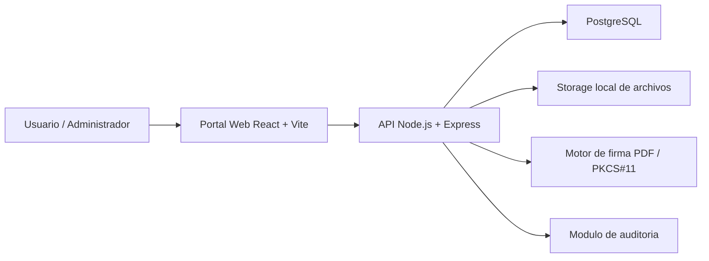

# Documentacion funcional y tecnica del proyecto Firma Digital

Ultima actualizacion: 8 de junio de 2026

## 1. Resumen ejecutivo

Firma Digital es una aplicacion web para gestionar documentos PDF, solicitudes de firma, conformidad documental, validacion de identidad, certificados digitales, auditoria y administracion de usuarios.

El sistema esta compuesto por:

- Un portal web desarrollado con React, Vite y TypeScript.
- Una API backend desarrollada con Node.js, Express y TypeScript.
- Una base de datos PostgreSQL.
- Un sistema de autenticacion con JWT, refresh token en cookie HttpOnly y control de roles.
- Almacenamiento local de archivos cargados y documentos firmados.
- Flujos de auditoria y trazabilidad por hash SHA-256.
- Soporte para firma PDF con certificados P12 en desarrollo y preparacion para PKCS#11, HSM o custodia externa de claves en produccion.

El objetivo principal es ofrecer una plataforma trazable y segura para operar documentos con evidencia tecnica y legal, manteniendo separacion entre usuarios comunes, administradores de organizacion y administradores globales.

## 2. Alcance funcional

La aplicacion permite:

- Registrar usuarios y organizaciones.
- Iniciar sesion y mantener sesion segura.
- Subir documentos PDF.
- Calcular y registrar hash SHA-256 de documentos.
- Enviar solicitudes de firma a firmantes.
- Aceptar conformidad antes de firmar.
- Firmar documentos mediante flujo de solicitud.
- Descargar documentos originales o firmados.
- Gestionar certificados digitales.
- Ejecutar flujo de validacion de identidad.
- Aprobar o rechazar validaciones de identidad desde panel administrativo.
- Consultar auditoria de eventos.
- Consultar metricas operativas en dashboard.
- Administrar usuarios, documentos e identidades segun permisos.

## 3. Arquitectura general



### Componentes principales

| Componente | Ubicacion | Responsabilidad |
|---|---|---|
| Portal web | `web-portal` | Interfaz de usuario, rutas, formularios y consumo de API |
| Backend API | `web-backend` | Autenticacion, reglas de negocio, archivos, firmas, permisos y auditoria |
| Base de datos | PostgreSQL | Persistencia de usuarios, documentos, solicitudes, certificados, identidad y auditoria |
| Storage | `uploads` / volumen Docker | Archivos PDF, versiones firmadas, certificados e imagenes de identidad |
| Scripts | `scripts` | Arranque, parada y chequeo local |
| Documentacion | `docs` | Checklist, auditoria y documentacion de proyecto |

## 4. Tecnologias utilizadas

### Frontend

| Tecnologia | Uso |
|---|---|
| React 18 | Construccion de interfaz |
| Vite 8 | Build, dev server y preview |
| TypeScript | Tipado estatico |
| React Router DOM | Rutas reales del portal |
| Tailwind CSS | Estilos |
| Lucide React | Iconografia |
| ESLint | Analisis estatico |
| Vitest | Pruebas frontend |
| Testing Library | Base para pruebas de componentes |

### Backend

| Tecnologia | Uso |
|---|---|
| Node.js | Runtime backend |
| Express | API HTTP |
| TypeScript | Tipado backend |
| PostgreSQL | Base de datos |
| pg | Cliente PostgreSQL |
| Zod | Validacion de entrada |
| jsonwebtoken | Access y refresh tokens |
| bcryptjs | Hash de contrasenas |
| helmet | Cabeceras de seguridad |
| cors | Politica CORS |
| express-rate-limit | Rate limiting basico |
| multer | Carga de archivos |
| pdf-lib | Lectura y manipulacion de PDF |
| @signpdf | Firma PDF |
| node-forge | Generacion de certificados en desarrollo |
| ESLint | Analisis estatico |
| tsx / node:test | Desarrollo y pruebas backend |

### Infraestructura local

| Tecnologia | Uso |
|---|---|
| Docker Compose | Orquestacion local de PostgreSQL, backend y frontend |
| PostgreSQL 16 | Base de datos |
| Volumenes Docker | Persistencia de DB y uploads |
| PowerShell scripts | Arranque y chequeo local en Windows |

## 5. Estructura de carpetas

```text
firmaDigital/
  package.json
  docker-compose.yml
  README.md
  docs/
  scripts/
    start-dev.ps1
    stop-dev.ps1
    check-app.ps1
  web-portal/
    src/
      app/
      features/
      shared/
    package.json
    vite.config.ts
    tailwind.config.js
  web-backend/
    src/
      config/
      database/
      middlewares/
      modules/
      utils/
      app.ts
      server.ts
      routes.ts
    package.json
```

## 6. Roles y permisos

| Rol | Alcance |
|---|---|
| `USER` | Opera sus propios documentos, solicitudes, perfil, identidad y certificados |
| `ORGANIZATION_ADMIN` | Acceso administrativo limitado a su organizacion |
| `ADMIN` | Acceso global de administracion |

### Reglas relevantes

- Un usuario solo lista sus propios documentos.
- Un firmante solo accede a solicitudes asignadas a su email.
- La auditoria documental solo puede ser vista por el propietario, firmantes relacionados o administradores autorizados.
- `ORGANIZATION_ADMIN` queda filtrado por `organization_id`.
- `ADMIN` puede ver todos los registros.
- Rutas administrativas del frontend solo se muestran para `ADMIN`.

## 7. Autenticacion y sesiones

El sistema utiliza:

- Access token JWT de corta duracion.
- Refresh token persistido en backend y enviado al navegador mediante cookie HttpOnly.
- Refresh token rotativo.
- Logout con revocacion del refresh token.
- Access token mantenido en memoria en el frontend.

### Beneficio de seguridad

El refresh token no queda disponible para JavaScript del navegador, reduciendo el impacto de posibles XSS. Los tokens legacy que pudieran existir en `localStorage` se limpian al cerrar sesion.

### Endpoints de autenticacion

| Metodo | Ruta | Descripcion |
|---|---|---|
| POST | `/api/auth/register` | Registra usuario |
| POST | `/api/auth/login` | Inicia sesion |
| POST | `/api/auth/refresh` | Renueva access token usando cookie HttpOnly |
| POST | `/api/auth/logout` | Revoca refresh token y limpia cookie |

## 8. Rutas frontend

| Ruta | Pantalla | Acceso |
|---|---|---|
| `/` | Redireccion a `/dashboard` | Usuario autenticado |
| `/dashboard` | Centro de control | Usuario autenticado |
| `/documents` | Gestion documental | Usuario autenticado |
| `/signatures` | Solicitudes de firma | Usuario autenticado |
| `/conformity` | Conformidades | Usuario autenticado |
| `/identity` | Validacion de identidad | Usuario autenticado |
| `/certificates` | Certificados | Usuario autenticado |
| `/audit` | Auditoria propia | Usuario autenticado |
| `/profile` | Perfil | Usuario autenticado |
| `/admin` | Panel administrativo | `ADMIN` |
| `?token=<token>` | Firma publica por token | Publico con token valido |
| `*` | Ruta no encontrada | Usuario autenticado |

El frontend usa fallback SPA, por lo que rutas internas como `/documents` o `/dashboard` pueden refrescarse directamente sin romper la carga del portal.

## 9. Modulos funcionales

### 9.1 Dashboard

Muestra una vision ejecutiva del estado operativo:

- Cantidad de documentos.
- Solicitudes pendientes.
- Documentos completados.
- Documentos rechazados.
- Ultimos documentos.
- Ultimos eventos de auditoria.

Backend relacionado:

- `GET /api/dashboard/summary`

### 9.2 Documentos

Permite:

- Subir PDF.
- Validar contenido real de PDF.
- Calcular hash SHA-256.
- Versionar documentos.
- Enviar solicitudes de firma.
- Descargar documentos.
- Ver seguimiento de firmantes.
- Firmar documentos propios con PKCS#11 para roles autorizados.

Endpoints principales:

| Metodo | Ruta | Descripcion |
|---|---|---|
| POST | `/api/documents` | Sube un PDF |
| GET | `/api/documents` | Lista documentos del usuario |
| GET | `/api/documents/:id` | Obtiene detalle |
| DELETE | `/api/documents/:id` | Elimina documento propio |
| POST | `/api/documents/:id/send` | Envia solicitudes de firma |
| GET | `/api/documents/:id/audit` | Auditoria del documento con permisos |
| GET | `/api/documents/:id/download` | Descarga documento |
| GET | `/api/documents/pkcs11/tokens` | Detecta tokens PKCS#11 |
| POST | `/api/documents/:id/sign/pkcs11` | Firma con PKCS#11 |

### 9.3 Solicitudes de firma

Permite operar documentos enviados a firmantes:

- Listar solicitudes asignadas.
- Ver detalle por ID.
- Ver detalle por token publico.
- Registrar visualizacion.
- Aceptar conformidad.
- Firmar.
- Rechazar.
- Descargar documento.

Endpoints:

| Metodo | Ruta | Descripcion |
|---|---|---|
| GET | `/api/signature-requests` | Lista solicitudes del usuario |
| GET | `/api/signature-requests/id/:id` | Detalle autenticado |
| POST | `/api/signature-requests/id/:id/conformity` | Acepta conformidad autenticada |
| POST | `/api/signature-requests/id/:id/sign` | Firma autenticada |
| POST | `/api/signature-requests/id/:id/reject` | Rechaza autenticado |
| GET | `/api/signature-requests/:token` | Detalle publico por token |
| POST | `/api/signature-requests/:token/view` | Registra visualizacion |
| POST | `/api/signature-requests/:token/conformity` | Acepta conformidad por token |
| POST | `/api/signature-requests/:token/sign` | Firma por token |
| POST | `/api/signature-requests/:token/reject` | Rechaza por token |
| GET | `/api/signature-requests/:token/download` | Descarga por token |

### 9.4 Conformidad

Antes de firmar, el firmante debe aceptar una declaracion de conformidad. Esto registra:

- Texto aceptado.
- Version del documento.
- Hash del documento.
- IP.
- User agent.
- Fecha.

Endpoints:

| Metodo | Ruta | Descripcion |
|---|---|---|
| GET | `/api/conformity` | Lista conformidades del usuario |
| POST | `/api/conformity/:id` | Acepta conformidad |

### 9.5 Identidad

Flujo de validacion de identidad:

1. Inicio del proceso.
2. Carga de datos personales.
3. Carga de frente de documento.
4. Carga de dorso de documento.
5. Carga de selfie.
6. Aceptacion de declaracion.
7. Envio a revision.
8. Aprobacion o rechazo por administrador.

Se validan extensiones, mimetype, tamano y firma real de archivo para JPG, PNG y WEBP.

Endpoints:

| Metodo | Ruta | Descripcion |
|---|---|---|
| GET | `/api/identity/me` | Obtiene identidad del usuario |
| POST | `/api/identity/start` | Inicia validacion |
| PATCH | `/api/identity/personal-data` | Actualiza datos personales |
| POST | `/api/identity/upload-document-front` | Sube frente de documento |
| POST | `/api/identity/upload-document-back` | Sube dorso de documento |
| POST | `/api/identity/upload-selfie` | Sube selfie |
| POST | `/api/identity/submit` | Envia a revision |
| GET | `/api/identity/status` | Consulta estado |

### 9.6 Certificados

Permite administrar certificados asociados al usuario.

En desarrollo, el sistema puede generar certificados P12 de software. En produccion, la generacion y uso de P12 por software esta bloqueada hasta integrar custodia segura de claves mediante KMS, HSM o PKCS#11.

Endpoints:

| Metodo | Ruta | Descripcion |
|---|---|---|
| POST | `/api/certificates` | Crea certificado |
| GET | `/api/certificates` | Lista certificados |
| GET | `/api/certificates/:id` | Detalle de certificado |
| GET | `/api/certificates/:id/download` | Descarga certificado |
| PATCH | `/api/certificates/:id/status` | Cambia estado |

### 9.7 Auditoria

Registra eventos relevantes:

- Registro de usuario.
- Subida de documento.
- Envio de documento.
- Visualizacion.
- Aceptacion de conformidad.
- Firma.
- Rechazo.
- Aprobacion o rechazo de identidad.
- Creacion de certificados.

Endpoints:

| Metodo | Ruta | Descripcion |
|---|---|---|
| GET | `/api/audit` | Auditoria reciente para administracion |
| GET | `/api/audit/me` | Auditoria del usuario |

### 9.8 Administracion

Panel para usuarios con permisos administrativos.

Permite:

- Ver metricas.
- Listar usuarios.
- Ver detalle de usuario.
- Listar documentos.
- Revisar validaciones de identidad.
- Aprobar identidad.
- Rechazar identidad.
- Ver documentos cargados por usuarios para identidad.

Endpoints:

| Metodo | Ruta | Descripcion |
|---|---|---|
| GET | `/api/admin/stats` | Estadisticas |
| GET | `/api/admin/users` | Lista usuarios |
| GET | `/api/admin/users/:id` | Detalle usuario |
| GET | `/api/admin/documents` | Lista documentos |
| GET | `/api/admin/identity-verifications` | Lista verificaciones |
| GET | `/api/admin/identity-verifications/:id` | Detalle verificacion |
| GET | `/api/admin/identity-verifications/:id/documents/:docId` | Imagen/documento de identidad |
| POST | `/api/admin/identity-verifications/:id/approve` | Aprueba identidad |
| POST | `/api/admin/identity-verifications/:id/reject` | Rechaza identidad |

### 9.9 Perfil de usuario

Permite consultar y actualizar datos basicos del usuario autenticado.

Endpoints:

| Metodo | Ruta | Descripcion |
|---|---|---|
| GET | `/api/users/me` | Perfil actual |
| PATCH | `/api/users/me` | Actualiza perfil |

### 9.10 Notificaciones

Modulo preparado para gestionar notificaciones.

Endpoint:

| Metodo | Ruta | Descripcion |
|---|---|---|
| GET | `/api/notifications` | Lista notificaciones administrativas |

## 10. Modelo de datos principal

Tablas principales:

| Tabla | Descripcion |
|---|---|
| `organizations` | Organizaciones registradas |
| `users` | Usuarios, roles y estados |
| `refresh_tokens` | Refresh tokens rotativos |
| `documents` | Documentos cargados |
| `document_versions` | Versiones de documentos y hashes |
| `signature_requests` | Solicitudes de firma |
| `signatures` | Firmas aplicadas |
| `conformity_acceptances` | Aceptaciones de conformidad |
| `identity_verifications` | Procesos de validacion de identidad |
| `identity_documents` | Archivos de identidad |
| `identity_audit_logs` | Auditoria especifica de identidad |
| `certificates` | Certificados asociados |
| `audit_logs` | Auditoria general |
| `notifications` | Cola/registro de notificaciones |

## 11. Seguridad implementada

| Control | Estado |
|---|---|
| Hash de contrasenas con bcrypt | Implementado |
| JWT access token | Implementado |
| Refresh token rotativo | Implementado |
| Refresh token en cookie HttpOnly | Implementado |
| Limpieza de tokens legacy en localStorage | Implementado |
| Helmet | Implementado |
| CORS configurable | Implementado |
| Rate limit general | Implementado |
| Validacion Zod en backend | Implementado |
| Validacion fuerte de uploads | Implementado |
| Scoping por organizacion | Implementado |
| Auditoria por documento con control de permisos | Implementado |
| Bloqueo de secretos default en produccion | Implementado |
| Bloqueo de P12 software en produccion | Implementado |

## 12. Firma digital y custodia de claves

El sistema soporta distintos escenarios:

- Firma de PDF con librerias de software para entornos de desarrollo.
- Preparacion para firma con PKCS#11.
- Preparacion para integracion con token fisico, HSM o proveedor externo.

Decision de seguridad actual:

- En desarrollo se permite P12 generado por software.
- En produccion se bloquea P12 por software con error `CERTIFICATE_CUSTODY_REQUIRED`.
- Para produccion se debe definir una custodia de clave privada mediante KMS, HSM, PKCS#11 o proveedor certificado.

Esto evita operar en produccion con claves privadas recuperables desde base de datos, disco o backups.

## 13. Variables de entorno

Backend:

| Variable | Descripcion |
|---|---|
| `NODE_ENV` | `development`, `test` o `production` |
| `PORT` | Puerto backend |
| `DATABASE_URL` | Conexion PostgreSQL |
| `JWT_ACCESS_SECRET` | Secreto de access token |
| `JWT_REFRESH_SECRET` | Secreto de refresh token |
| `JWT_ACCESS_EXPIRES_IN` | Expiracion access token |
| `JWT_REFRESH_EXPIRES_IN` | Expiracion refresh token |
| `CORS_ORIGIN` | Origenes permitidos |
| `UPLOADS_DIR` | Directorio de documentos |
| `MAX_FILE_SIZE_MB` | Tamano maximo identidad |
| `IDENTITY_UPLOAD_DIR` | Directorio de identidad |
| `IDENTITY_EXPIRES_DAYS` | Vigencia de identidad |
| `APP_URL` | URL del frontend |
| `API_URL` | URL backend |
| `ADMIN_EMAIL` | Email admin inicial |
| `ADMIN_PASSWORD` | Password admin inicial |
| `PKCS11_MODULE_PATH` | Modulo PKCS#11 |
| `PKCS11_TOOL_PATH` | Ruta a herramienta PKCS#11 |
| `PKCS11_CERT_ID` | ID de certificado PKCS#11 |
| `PYHANKO_PYTHON_PATH` | Python para firma con pyHanko |

Frontend:

| Variable | Descripcion |
|---|---|
| `VITE_API_URL` | URL de la API, por ejemplo `http://localhost:4000/api` |
| `VITE_APP_NAME` | Nombre visible de la aplicacion |

Importante: los valores de ejemplo de Docker Compose deben reemplazarse para produccion. El backend bloquea el arranque si detecta secretos default en `NODE_ENV=production`.

## 14. Instalacion y ejecucion local

### Requisitos

- Node.js compatible con el proyecto.
- npm.
- Docker Desktop o PostgreSQL local.
- PowerShell en Windows.

### Opcion con scripts

```powershell
npm install
npm run dev
```

Detener:

```powershell
npm run stop
```

Chequeo:

```powershell
npm run check
```

### Backend

```powershell
cd web-backend
npm install
npm run db:migrate
npm run db:seed
npm run dev
```

### Frontend

```powershell
cd web-portal
npm install
npm run dev
```

URLs locales:

| Servicio | URL |
|---|---|
| Frontend dev | `http://127.0.0.1:5173` |
| Frontend preview | `http://127.0.0.1:4173` |
| Backend | `http://127.0.0.1:4000` |
| Health backend | `http://127.0.0.1:4000/health` |
| PostgreSQL Docker | `localhost:5436` |

## 15. Comandos de calidad

Raiz:

```powershell
npm run typecheck
```

Backend:

```powershell
npm --prefix web-backend run build
npm --prefix web-backend run typecheck
npm --prefix web-backend run lint
npm --prefix web-backend run test
```

Frontend:

```powershell
npm --prefix web-portal run build
npm --prefix web-portal run typecheck
npm --prefix web-portal run lint
npm --prefix web-portal run test
```

## 16. Testing existente

### Backend

Pruebas implementadas:

- Acceso a auditoria documental por propietario.
- Acceso a auditoria documental por administrador.
- Acceso a auditoria documental por firmante.
- Bloqueo de acceso a auditoria documental por usuario ajeno.
- Scope global de `ADMIN`.
- Scope por organizacion de `ORGANIZATION_ADMIN`.
- Bloqueo de acceso global para `ORGANIZATION_ADMIN` sin organizacion.

### Frontend

Pruebas implementadas:

- Login guarda access token en memoria.
- Refresh usa cookie HttpOnly con `credentials: include`.
- Logout limpia tokens legacy de `localStorage`.

## 17. Despliegue

El proyecto puede desplegarse en plataformas que soporten frontend SPA y backend Node.js:

- Frontend: Vercel, Netlify, Cloudflare Pages, Firebase Hosting o Nginx.
- Backend: VPS, Docker, Render, Railway, Fly.io, ECS, Kubernetes u otro runtime Node.js.
- Base de datos: PostgreSQL administrado o PostgreSQL Docker con backups.

### Requisitos para produccion

- HTTPS obligatorio.
- Variables de entorno productivas.
- Secretos JWT fuertes.
- Password PostgreSQL fuerte.
- Dominio y CORS correctamente configurados.
- Storage persistente para uploads.
- Backups de base de datos y archivos.
- Monitoreo de errores.
- Logs centralizados.
- Estrategia de custodia de claves privadas.
- Configuracion de fallback SPA para rutas internas.

### Fallback SPA

El frontend usa React Router. El hosting debe redirigir cualquier ruta interna a `index.html`, por ejemplo:

- `/dashboard`
- `/documents`
- `/admin`
- `/identity`

## 18. Estado actual del proyecto

Estado tecnico actual:

- Build backend: correcto.
- Build frontend: correcto.
- Typecheck backend/frontend: correcto.
- ESLint backend/frontend: correcto.
- Tests backend/frontend: correctos.
- Rutas internas frontend: implementadas con React Router.
- Refresh directo de rutas internas: validado en Vite preview.

Pendientes recomendados antes de produccion:

- Definir custodia productiva de claves: KMS, HSM, PKCS#11 o proveedor.
- Configurar hosting final y variables reales.
- Validar flujo completo con backend y base de datos en ambiente staging.
- Configurar backups y monitoreo.
- Definir politicas legales de privacidad, terminos y retencion de datos.
- Ejecutar pruebas manuales con usuarios reales de prueba.

## 19. Riesgos y consideraciones para cliente

| Tema | Consideracion |
|---|---|
| Firma digital | La validez legal depende del proveedor/certificado/custodia usados en produccion |
| Datos personales | La validacion de identidad procesa informacion sensible |
| Backups | Deben contemplar base de datos y archivos |
| Certificados | No se recomienda almacenar claves privadas recuperables |
| Auditoria | Debe preservarse contra alteraciones y con retencion definida |
| Email/notificaciones | El modulo esta preparado, pero debe integrarse con proveedor real si se requiere envio automatico |
| Escalabilidad | Storage local sirve para ambiente inicial; produccion puede requerir S3, GCS, Azure Blob u otro |

## 20. Glosario

| Termino | Definicion |
|---|---|
| Access token | Token de corta duracion para autorizar llamadas API |
| Refresh token | Token de renovacion de sesion |
| Cookie HttpOnly | Cookie no accesible por JavaScript |
| SHA-256 | Algoritmo de hash usado para trazabilidad documental |
| PKCS#11 | Estandar para interactuar con tokens criptograficos/HSM |
| P12/PFX | Formato de archivo que puede contener certificado y clave privada |
| HSM | Hardware Security Module para custodiar claves |
| KMS | Key Management Service para gestion segura de claves |
| KYC | Proceso de validacion de identidad |

## 21. Resumen para presentacion

Firma Digital es una plataforma web modular para operar documentos, firmas, conformidad, identidad y auditoria. La solucion esta preparada con arquitectura separada frontend/backend, base PostgreSQL, autenticacion segura, trazabilidad por hash, control de roles, validacion de archivos y rutas reales para una experiencia web profesional.

Para produccion, el principal punto de decision es la custodia de claves de firma. El sistema ya bloquea el uso inseguro de certificados P12 por software en produccion y queda listo para integrarse con una solucion adecuada como PKCS#11, HSM, KMS o proveedor externo.

